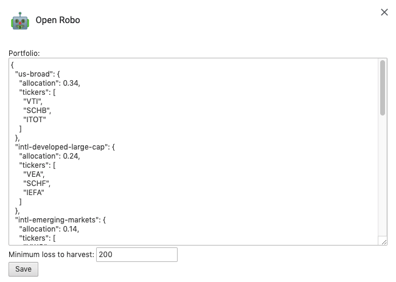

# Security first!
Open Robo will **never** ask for your Vanguard account credentials. Do not provide your username, password,
or other account information to any application or person claiming to represent Open Robo.

Now that we've gotten that out of the way, we can start investing.

## Step 1: Set up a Vanguard account

[Vanguard](https://investor.vanguard.com/home/) charges neither account maintenance fees nor trading
fees for the vast majority of ETFs. You'll need an account to get started.

## Step 2: Install the Chrome extension

[Right
here!](https://chrome.google.com/webstore/detail/open-robo/hpikenahheicmjdkhakibjbenodblapf?authuser=1)

## Step 3: Choose a portfolio

You'll need to choose the different asset categories in which you want to invest, the ETF tickers that
back them, and the relative allocation of each category. Your choice goes into the "Portfolio" blob in
the Open Robo settings page.



The portfolio is represented as a JSON object mapping categories to their allocation and tickers.
Providing multiple tickers for each category allows Open Robo to harvest losses in your account.
Here's an example of a simple portfolio that splits investments evenly between US and international
broad market funds:

```
{
  "us-broad-market": {
    "allocation": 0.5,
    "tickers": ["VTI", "ITOT"]
  },
  "international-broad-market": {
    "allocation": 0.5,
    "tickers": ["VEU", "IXUS"]
  }
}
```

The portfolio that's best for you depends on your risk tolerance, income needs, and beliefs about
the future. We recommend filling out the questionnaire for a third party robo-advisor (typically
free), researching common asset blends, or asking a trusted friend for advice.

## Step 4: Start investing

As you deposit funds into your investment account, Open Robo will help you invest them in ETFs to 
maintain your desired allocations. See the investment walkthrough for more info.
