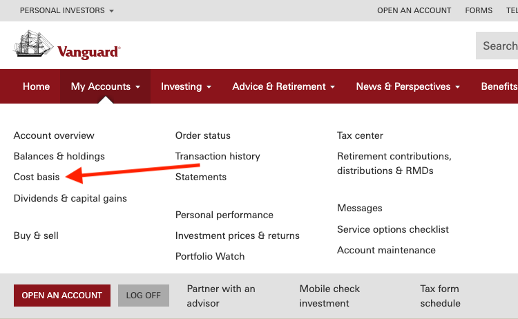
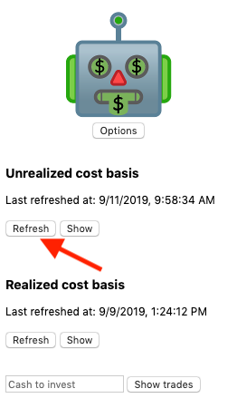
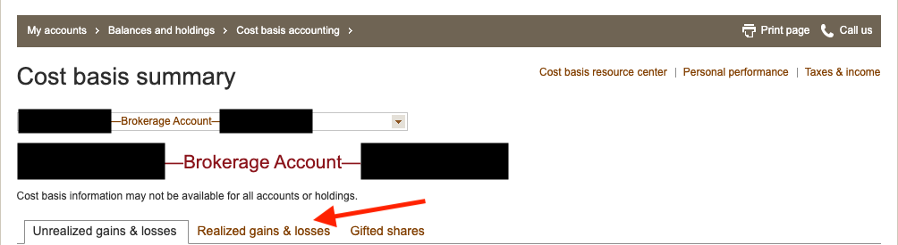
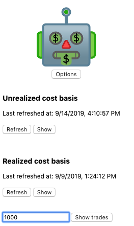
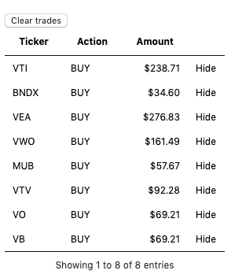

# Investing Walkthrough

So, you've set up a Vanguard account and installed the Open Robo extension. Now you want to start
putting your money to work. You've come to the right place. This page describes the process for
putting money in or taking money out of your account. It only takes a few minutes!

## Capture current account information

To make investment decisions, Open Robo needs to understand your current and recently sold holdings.

First, navigate to the cost basis page:

While the "Unrealized gains & losses" tab is open, click the button to refresh the unrealized cost
basis in the Open Robo popup:

After you see a green checkmark appear to indicate that the refresh has succeeded, you can click on
the "Show" button in Open Robo to display the captured information. To verify that it is correct,
you can compare the "Total market value" at the bottom of the table to the total market value in
Vanguard.

You'll need to repeat this process for the realized gains and losses. Open the "Realized gains &
losses" tab in Vanguard:

Then click the "Refresh" button under the "Realized cost basis" tab in Open Robo. You can verify
that the capture completed successfully like you did for the unrealized cost basis.

## Buying shares

First, you'll need to [transfer funds into your Vanguard
account](https://investor.vanguard.com/investing/online-trading/add-money). Then, you can ask Open
Robo to tell you how of which stocks to buy.

From the Open Robo popup, enter how much money (in USD) you want to invest. In this example, we're
investing $1,000:

After clicking "Show trades", you'll see a table with suggested trades:

You can execute these trades through Vanguard by navigating from the top bar to "My Accounts > Buy &
sell > Trade Vanguard ETFs (and non-Vanguard ETFs)". You can use the dollars to shares calculator in
the trading dialogue to determine the number of shares. The calculator rounds down to the nearest
whole share. On normal trading days, market orders are appropriate for high volume ETFs.

## Selling shares

To withdraw money, enter the investment amount as a negative number, for example `-1000`. Open Robo
will then display a table of ETFs to sell. 

## Tax loss harvesting

[Tax loss harvesting](https://en.wikipedia.org/wiki/Wash_sale#Tax_Loss_Harvesting) is a tax deferral
strategy. You sell an ETF for a loss that can be subtracted from capital gains and buy a different
ETF that tracks a similar index. Whenever you invest or withdraw money, Open Robo will check your
portfolio for qualifying losses. The trades table will then tell you to sell all shares of a given
ETF that are currently held for a loss and buy shares of a secondary ETF from the same portfolio
category.

To sell all shares with a potential loss, select the "SpecID" cost basis method from the ETF trading
dialogue. You can then sort holdings by "Estimated total gain/loss" and quickly select all holdings
with a negative value.
